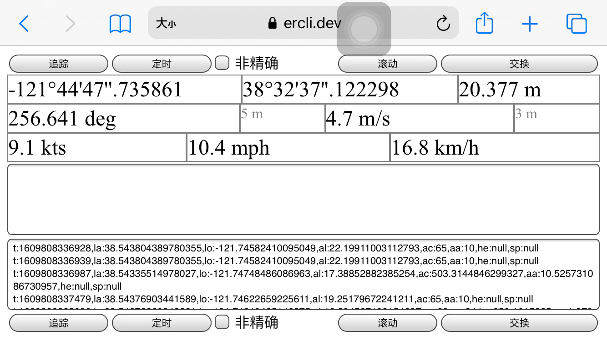
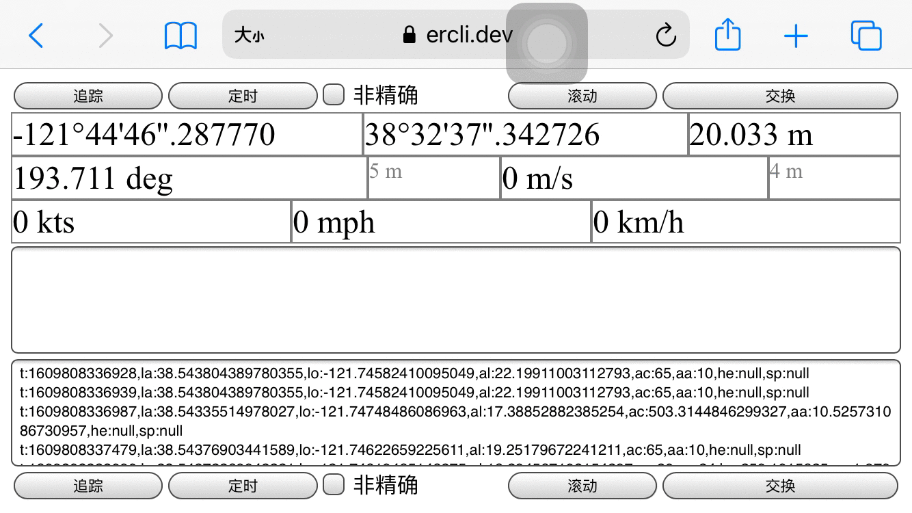

# LocationTrackerWeb

A web page that allows user to track and export their current location.

* This project is based on
 [LocationTracker](https://github.com/lxylxy123456/LocationTracker)
 (an iOS app).

* Currently the texts are in Chinese.

* To use this project, host [ll.html](ll.html) in an HTTPS server (HTTP does not
  work) and access it. Click the left-most button to start tracking.

* I have hosted it here: [https://ercli.dev/ll.html](https://ercli.dev/ll.html)
 or
 [https://lxylxy123456.github.io/ll.html](https://lxylxy123456.github.io/ll.html)

* An older version: [l.html](l.html) or
  [https://ercli.dev/l.html](https://ercli.dev/l.html).

## Demo

Screenshot: 

Gif: 

Watch on Youtube:

